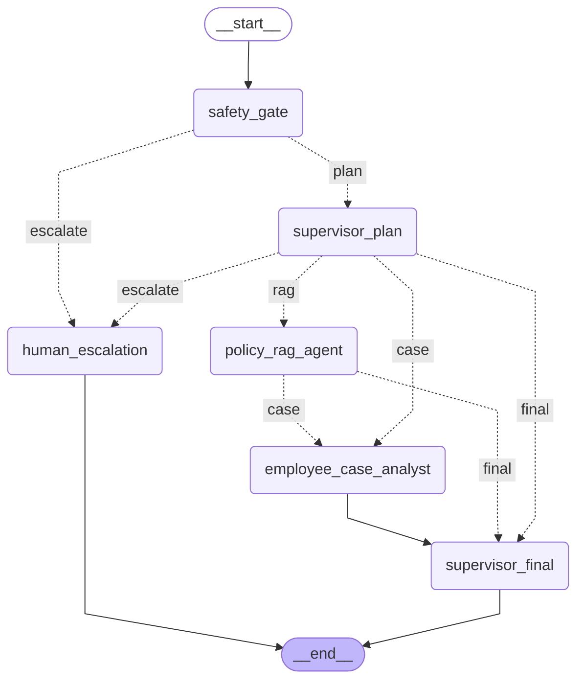

# PeopleGuide agent graph

Generated from the application LangGraph definition.

```mermaid
---
config:
  flowchart:
    curve: linear
---
graph TD;
	__start__([<p>__start__</p>]):::first
	safety_gate(safety_gate)
	supervisor_plan(supervisor_plan)
	policy_rag_agent(policy_rag_agent)
	employee_case_analyst(employee_case_analyst)
	supervisor_final(supervisor_final)
	human_escalation(human_escalation)
	__end__([<p>__end__</p>]):::last
	__start__ --> safety_gate;
	employee_case_analyst --> supervisor_final;
	policy_rag_agent -. &nbsp;case&nbsp; .-> employee_case_analyst;
	policy_rag_agent -. &nbsp;final&nbsp; .-> supervisor_final;
	safety_gate -. &nbsp;escalate&nbsp; .-> human_escalation;
	safety_gate -. &nbsp;plan&nbsp; .-> supervisor_plan;
	supervisor_plan -. &nbsp;case&nbsp; .-> employee_case_analyst;
	supervisor_plan -. &nbsp;escalate&nbsp; .-> human_escalation;
	supervisor_plan -. &nbsp;rag&nbsp; .-> policy_rag_agent;
	supervisor_plan -. &nbsp;final&nbsp; .-> supervisor_final;
	human_escalation --> __end__;
	supervisor_final --> __end__;
	classDef default fill:#f2f0ff,line-height:1.2
	classDef first fill-opacity:0
	classDef last fill:#bfb6fc

```
